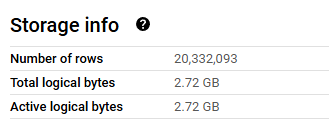
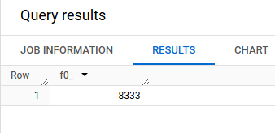
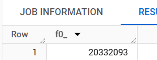

# Module 3 Homework

## Setting Up for homework

- I created this flow for downloading the data and uploading it to GCP using kestra docker image `-that is running in a vm also on gcp-`
- I ran this for the 6 monthes

```yml
id: week3-upload-data
namespace: zoomcamp
description:
  "https://d37ci6vzurychx.cloudfront.net/trip-data/yellow_tripdata_2024-01.parquet" 

inputs:
  - id: taxi
    type: SELECT
    displayName: Select taxi type
    values: [yellow]
    defaults: yellow

  - id: year
    type: SELECT
    displayName: Select year
    values: ["2019", "2020","2024"]
    defaults: "2024"
    allowCustomValue: true # allows you to type 2021 from the UI for the homework 🤗

  - id: month
    type: SELECT
    displayName: Select month
    values: ["01", "02", "03", "04", "05", "06", "07", "08", "09", "10", "11", "12"]
    defaults: "01"

variables:
  file: "{{inputs.taxi}}_tripdata_{{inputs.year}}-{{inputs.month}}.parquet"
  gcs_file: "gs://{{kv('GCP_BUCKET_NAME')}}/Week3/{{vars.file}}"
  data: "{{outputs.extract.outputFiles[inputs.taxi ~ '_tripdata_' ~ inputs.year ~ '-' ~ inputs.month ~ '.parquet']}}"

tasks:
  - id: set_label
    type: io.kestra.plugin.core.execution.Labels
    labels:
      file: "{{render(vars.file)}}"
      taxi: "{{inputs.taxi}}"

  - id: extract
    type: io.kestra.plugin.scripts.shell.Commands
    outputFiles:
      - "*.parquet"
    taskRunner:
      type: io.kestra.plugin.core.runner.Process
    commands:
      - wget https://d37ci6vzurychx.cloudfront.net/trip-data/{{render(vars.file)}}

  - id: upload_to_gcs
    type: io.kestra.plugin.gcp.gcs.Upload
    from: "{{render(vars.data)}}"
    to: "{{render(vars.gcs_file)}}"

  - id: purge_files
    type: io.kestra.plugin.core.storage.PurgeCurrentExecutionFiles
    description: If you'd like to explore Kestra outputs, disable it.
    disabled: false

pluginDefaults:
  - type: io.kestra.plugin.gcp
    values:
      serviceAccount: "{{kv('GCP_CREDS')}}"
      projectId: "{{kv('GCP_PROJECT_ID')}}"
      location: "{{kv('GCP_LOCATION')}}"
      bucket: "{{kv('GCP_BUCKET_NAME')}}"

```

- Then on the BigQuery SQL I created and external table and a non-partitioned table from it as follows

```SQL
-- Create an external table
CREATE OR REPLACE EXTERNAL TABLE `nice-diorama-447813-u8.Week3zoomcamp.external_yellow_tripdata`
OPTIONS (
  format = 'PARQUET',
  uris = ['gs://vm-snow-kestra-bucket/Week3/yellow_tripdata_2024-*.parquet']
);

-- Create a non partitioned table from external table
CREATE OR REPLACE TABLE nice-diorama-447813-u8.Week3zoomcamp.yellow_tripdata_non_partitioned AS
SELECT * FROM nice-diorama-447813-u8.Week3zoomcamp.external_yellow_tripdata;
```

- now we have both tables and ready to start

---

## Question 1

Question 1: What is count of records for the 2024 Yellow Taxi Data?

- 65,623
- 840,402
- `20,332,093`
- 85,431,289

#### Answer is `20,332,093`

we can find this in the details of the non-partitioned table


---

## Question 2

Write a query to count the distinct number of PULocationIDs for the entire dataset on both the tables.</br>
What is the **estimated amount** of data that will be read when this query is executed on the External Table and the Table?

- 18.82 MB for the External Table and 47.60 MB for the Materialized Table
- `0 MB for the External Table and 155.12 MB for the Materialized Table`
- 2.14 GB for the External Table and 0MB for the Materialized Table
- 0 MB for the External Table and 0MB for the Materialized Table

#### Answer is `0 MB for the External Table and 155.12 MB for the Materialized Table`

When running these sql lines we get this for each of them

```SQL
SELECT COUNT(DISTINCT PULocationID) FROM nice-diorama-447813-u8.Week3zoomcamp.yellow_tripdata_non_partitioned;
```


```SQL
SELECT COUNT(DISTINCT PULocationID) FROM nice-diorama-447813-u8.Week3zoomcamp.external_yellow_tripdata;
```


---

## Question 3

Write a query to retrieve the PULocationID from the table (not the external table) in BigQuery. Now write a query to retrieve the PULocationID and DOLocationID on the same table. Why are the estimated number of Bytes different?

- `BigQuery is a columnar database, and it only scans the specific columns requested in the query. Querying two columns (PULocationID, DOLocationID) requires
reading more data than querying one column (PULocationID), leading to a higher estimated number of bytes processed.`
- BigQuery duplicates data across multiple storage partitions, so selecting two columns instead of one requires scanning the table twice,
doubling the estimated bytes processed.
- BigQuery automatically caches the first queried column, so adding a second column increases processing time but does not affect the estimated bytes scanned.
- When selecting multiple columns, BigQuery performs an implicit join operation between them, increasing the estimated bytes processed

#### Answer is `BigQuery is a columnar database`

When running these sql lines we get this for each of them

```SQL
SELECT PULocationID FROM nice-diorama-447813-u8.Week3zoomcamp.yellow_tripdata_non_partitioned;
```


```SQL
SELECT PULocationID,DOLocationID  FROM nice-diorama-447813-u8.Week3zoomcamp.yellow_tripdata_non_partitioned; 
```


and this is due to selecting another column from the table

---

## Question 4

How many records have a fare_amount of 0?

- 128,210
- 546,578
- 20,188,016
- `8,333`

#### Answer is `8,333`

After running this SQL line

```SQL
SELECT COUNT(*) FROM nice-diorama-447813-u8.Week3zoomcamp.yellow_tripdata_non_partitioned
WHERE fare_amount = 0;
```

We get this result


---

## Question 5

What is the best strategy to make an optimized table in Big Query if your query will always filter based on tpep_dropoff_datetime and order the results by VendorID (Create a new table with this strategy)

- `Partition by tpep_dropoff_datetime and Cluster on VendorID`
- Cluster on by tpep_dropoff_datetime and Cluster on VendorID
- Cluster on tpep_dropoff_datetime Partition by VendorID
- Partition by tpep_dropoff_datetime and Partition by VendorID

#### Answer is `Partition by tpep_dropoff_datetime and Cluster on VendorID`

The SQL Query

```SQL
CREATE OR REPLACE TABLE nice-diorama-447813-u8.Week3zoomcamp.yellow_tripdata_partitioned
PARTITION BY DATE(tpep_dropoff_datetime)
CLUSTER BY VendorID AS
SELECT * FROM nice-diorama-447813-u8.Week3zoomcamp.yellow_tripdata_non_partitioned;
```

- Partitioning by tpep_dropoff_datetime
Since the query always filters on tpep_dropoff_datetime, partitioning by this column ensures:
  - Faster query performance (only relevant partitions are scanned).
  - Lower cost (BigQuery reads fewer partitions instead of the whole table).
- Clustering on VendorID
    Since the query orders by VendorID, clustering by VendorID:
  - Optimizes sorting (BigQuery stores data in blocks with similar VendorIDs).
  - Improves filtering if a VendorID filter is added later.

---

## Question 6

Write a query to retrieve the distinct VendorIDs between tpep_dropoff_datetime
2024-03-01 and 2024-03-15 (inclusive)</br>

Use the materialized table you created earlier in your from clause and note the estimated bytes. Now change the table in the from clause to the partitioned table you created for question 5 and note the estimated bytes processed. What are these values? </br>

Choose the answer which most closely matches.</br>

- 12.47 MB for non-partitioned table and 326.42 MB for the partitioned table
- `310.24 MB for non-partitioned table and 26.84 MB for the partitioned table`
- 5.87 MB for non-partitioned table and 0 MB for the partitioned table
- 310.31 MB for non-partitioned table and 285.64 MB for the partitioned table

#### Answer is `310.24 MB for non-partitioned table and 26.84 MB for the partitioned table`

When Running the SQL Query

```SQL
SELECT DISTINCT VendorID
FROM nice-diorama-447813-u8.Week3zoomcamp.yellow_tripdata_non_partitioned
WHERE tpep_dropoff_datetime BETWEEN '2024-03-01' AND '2024-03-15';
```

we get this

And for the other optimized table

```SQL
SELECT DISTINCT VendorID
FROM nice-diorama-447813-u8.Week3zoomcamp.yellow_tripdata_partitioned
WHERE tpep_dropoff_datetime BETWEEN '2024-03-01' AND '2024-03-15';
```


---

## Question 7

Where is the data stored in the External Table you created?

- Big Query
- Container Registry
- `GCP Bucket`
- Big Table

#### Answer is `GCP Bucket`

External Table in BigQuery refers to a table that does not store data inside BigQuery but instead references data stored externally.

---

## Question 8

It is best practice in Big Query to always cluster your data:

- True
- `False`

#### Answer is `False`

We only use it when it improves performance

```
Clustering should be avoided when:
- The dataset is small (clustering overhead outweighs benefits).
- The column chosen has low cardinality (e.g., only a few unique values).
- Queries do not filter or sort by the clustered column.
- The table is heavily updated, as clustering cannot be modified after table creation.
```

## (Bonus: Not worth points) Question 9

No Points: Write a `SELECT count(*)` query FROM the materialized table you created. How many bytes does it estimate will be read? Why?

#### Answer is `0 Bytes` I guess :D

When running this Query

```SQL
SELECT COUNT(*) FROM nice-diorama-447813-u8.Week3zoomcamp.yellow_tripdata_non_partitioned;
```

we get this


I guess because BigQuery depends on columns and this counts all the rows :V

# gg
